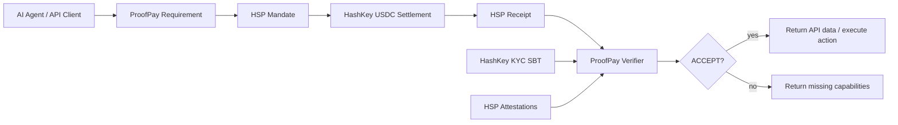

# Architecture

## Package Boundaries

- Core knows how to model policy and decisions.
- HSP integration is an adapter boundary so the pre-1.0 SDK can change without rewriting product logic.
- HashKey KYC checks are isolated behind `KycProvider`.
- HTTP middleware only consumes core decisions.

## Verification Model

The verifier accepts only when all policy requirements are met:

- correct recipient
- correct chain
- exact or minimum amount
- accepted token
- unexpired mandate/receipt
- required HSP capabilities
- required HashKey KYC level/status
- required compliance attestations

